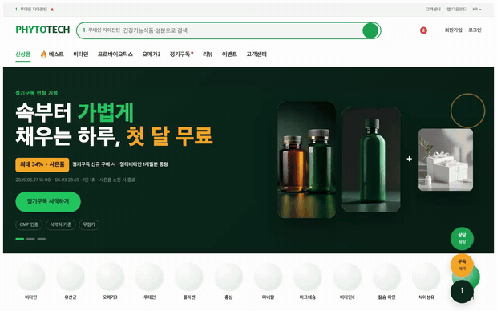
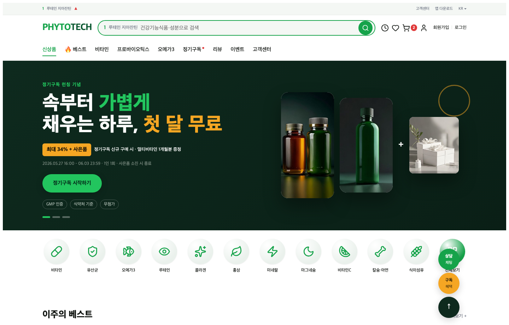
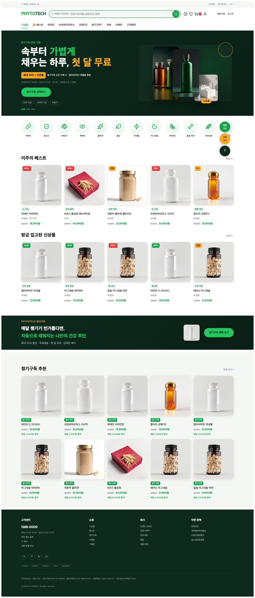

# web-uiux-design-from-reference

**참고할 웹사이트를 주면, 그 UI/UX 느낌을 분석·재해석해 새 브랜드용 웹페이지로 만들어 주는 도구입니다.**
기본 결과물은 [카페24](https://www.cafe24.com/) 에디터에 바로 붙일 수 있는 HTML 조각이지만, **카페24·HTML은 기본 어댑터일 뿐** 핵심 엔진은 거기에 묶여 있지 않습니다(아래 [지원 범위](#지원-범위) 참고).

작동 흐름을 한 줄로:

> **레퍼런스 사이트 → 디자인 분석·재해석 → HTML/CSS 구현 → AI가 "잘 맞는지" 점수 매겨 반복 수정 → 납품용 HTML 조각(기본 어댑터: 카페24)**

<p align="center">
  
  <br>
  <em>예제 결과 데모 — 자동차용품몰 autowash.co.kr 의 UI/UX 느낌을 가상 건강기능식품 브랜드 PHYTOTECH 로 재해석 (히어로 캐러셀 + 스크롤)</em>
</p>

- 🎨 **베끼는 게 아닙니다.** 픽셀을 그대로 복제하는 게 아니라, 레이아웃·색·타이포·정보 밀도 같은 *느낌*을 가져와 **다른 브랜드로 재해석**합니다.
- 🧩 **프론트엔드 전용.** 백엔드·DB 없음. 보이는 화면과 동작(스크롤·캐러셀 등)까지만.
- 🔁 **"감"이 아니라 점수로 수렴.** AI가 매 컴포넌트를 0~1로 채점하고, 기준 점수에 도달하거나 최대 횟수에 닿을 때까지 자동 반복합니다.
- 🔌 **카페24·HTML에 묶이지 않습니다.** 채점은 *렌더된 화면(DOM)* 기준이라 프레임워크와 무관합니다. 지금은 "HTML 작성 + 카페24 export"만 구현돼 있을 뿐, 다른 프레임워크/납품 타깃은 어댑터만 추가하면 됩니다 → [지원 범위](#지원-범위).

---

## ⚠️ 먼저 알아둘 것 — 이건 "버튼 하나로 뽑는 자동 생성기"가 아닙니다

이 저장소는 **[Claude Code](https://docs.claude.com/claude-code)(AI 에이전트) 안에서 단계별로 진행하는 워크플로**입니다.

| 누가 | 무엇을 |
|---|---|
| **AI 에이전트** (Claude Code) | 디자인 도출, HTML/CSS 구현, 수정 |
| **독립 채점관** (별도 서브에이전트) | "디자인 의도에 맞는지" 시각 채점 — *구현한 에이전트와 분리*(자기 채점 편향 방지) |
| **자동 스크립트** (`npm run …`) | 조각 합치기, 스크린샷 캡처, 점수 집계, 다음 행동 결정, export |
| **사람(당신)** | 두 번의 게이트에서 확인·결정 (디자인 OK? / 구현 OK?) |

즉, `git clone` 후 `npm install`만 한다고 사이트가 뚝딱 나오지 않습니다. **Claude Code에서 슬래시 커맨드(`/clone:01-reference` …)를 따라가며** 함께 만듭니다. 순수 명령줄로 자동 실행되는 건 "측정/채점/조립" 같은 기계적 부분뿐입니다.

> AI 채점도 **기본은 Claude Code가 직접** 합니다 — **별도 API 키가 필요 없습니다.** (원한다면 Anthropic API 키로 완전 자동화도 가능)

---

## 결과 미리보기

이 저장소에는 **완성된 예제**가 들어 있습니다: `runs/phytotech-cafe24/`
— 자동차용품 쇼핑몰 [autowash.co.kr](https://autowash.co.kr/) 의 UI/UX를, 가상의 건강기능식품 브랜드 **PHYTOTECH** 로 재해석한 풀 페이지입니다.

<p align="center"></p>

직접 브라우저로 보려면:

```bash
npm install
npx playwright install chromium
npm run serve -- phytotech-cafe24      # → http://127.0.0.1:4173 (완성 페이지)
```

<details>
<summary>📄 전체 페이지 한 장으로 보기 (스크롤 길이)</summary>

<p align="center"></p>

</details>

띄워진 페이지에서 스크롤(헤더 그림자), 히어로 배너 도트, 상품 카드 클릭(장바구니 담기), 맨위로 버튼 등이 **실제로 동작**합니다.
구성: 상단바 · 헤더(검색/아이콘) · 히어로 캐러셀 · 카테고리 · 상품 그리드 2종 · 프로모 배너 · 푸터 · 플로팅 버튼.

---

## 빠른 체험 (Claude Code 없이, 5분)

Claude Code가 없어도 "기계적 부분"은 직접 돌려볼 수 있습니다.

```bash
npm install
npx playwright install chromium

# 1) 최소 예제 한 바퀴 (스크린샷 캡처 → 점수 → 다음 행동 결정)
npm run loop -- example

# 2) 완성 예제 보기
npm run serve -- phytotech-cafe24            # http://127.0.0.1:4173 (페이지)
npm run serve -- phytotech-cafe24 root 4174  # http://127.0.0.1:4174/design/preview.html (디자인 명세서)
```

`example` 은 AI 채점을 끈 상태라 키·에이전트 없이 한 줄로 끝까지 돕니다.

---

## 처음부터 새로 만들기 (Claude Code에서)

```bash
npm run new-run -- mysite     # runs/mysite/ 뼈대 생성
```

그다음 Claude Code에서 순서대로 진행합니다:

| 단계 | 커맨드 | 하는 일 |
|---|---|---|
| 1 | `/clone:01-reference mysite` | 참고 사이트 캡처(스크린샷·구조 분석) |
| 2 | `/clone:02-design mysite` | 색·글꼴·컴포넌트 등 **디자인 명세** 도출 |
| 2.5 | `/clone:02-review mysite` | **이 디자인이 원본 느낌을 잘 담았나** 확인 (게이트) |
| 3 | `/clone:03-implement mysite` | HTML/CSS로 구현 |
| 4 | `/clone:04-loop mysite` | 컴포넌트별 점수 매겨 **자동 반복 수정** |
| 5 | `/clone:05-gate mysite` | 결과 확인 → 다듬기 vs 진행 (게이트) |
| 6 | `/clone:06-interactions mysite` | 스크롤·캐러셀 등 **동작** 추가 |
| 7 | `/clone:07-export mysite` | **카페24용 HTML 조각** 뽑기 + 최종 점검 |

(슬래시 커맨드는 `.claude/commands/clone/` 에 들어 있어, 이 저장소를 연 Claude Code에서 바로 뜹니다.)

---

## 무엇이 어디에 있나

```
clone-harness/            # 재사용 엔진 (모든 프로젝트가 공유)
├── scripts/              #   조립·서버·캡처·채점·export·레퍼런스 캡처·디자인 미리보기
├── signals/              #   채점 항목들: 레이아웃·색·글꼴·픽셀·시각(AI)
├── judge/                #   다음 행동 결정(자동 반복할지/사람 부를지) + 루프 진행
├── schemas/              #   입력 파일 검증(JSON Schema)
├── commands/             #   단계별 슬래시 커맨드 원본
└── config.default.json   #   기본 설정(점수 기준·가중치 등)

runs/<이름>/              # 프로젝트 1개 = 폴더 1개
├── reference/            #   1) 참고 사이트 분석 자료
├── design/               #   2) 도출된 디자인 명세 (색·글꼴·컴포넌트)
├── src/                  #   3) 실제 HTML/CSS/JS + 이미지(assets/)
├── work/                 #   진행 중 산출물(스크린샷·점수 로그) — git 추적 안 함
└── dist/                 #   4) 최종 카페24 조각 — git 추적 안 함
```

> `runs/example/`, `runs/phytotech-cafe24/` 는 **예제**로 그대로 둡니다. 새 작업은 `npm run new-run` 으로 만드세요.

---

## 지원 범위

엔진은 **세 층으로 분리**돼 있어, 어디까지가 묶여 있고 어디부터 갈아끼울 수 있는지가 분명합니다.

| 층 | 하는 일 | 묶임 정도 |
|---|---|---|
| **측정·채점·루프** | 렌더된 화면(DOM) 캡처 → 점수 → 다음 행동 결정 | **프레임워크 무관** — React/Vue/Svelte 결과물도 원리상 그대로 채점 |
| **작성(authoring)** | 컴포넌트 구현 → 페이지 조립 | 현재 **순수 HTML/CSS/JS** (`scripts/assemble.mjs`) |
| **납품(delivery)** | 결과를 배포 포맷으로 변환 | **교체 가능한 어댑터** (`config.export.adapter`) — `cafe24-fragment`(기본·단일 정적 조각), `cafe24-skin`(카페24 실제 클래스 타깃 CSS + 모듈 마크업 + 목업 트윈) |

- 채점은 Playwright 가 *렌더된 DOM* 의 `data-component`·computed style·스크린샷을 보고 합니다. 즉 **무엇으로 만들었든 화면만 뜨면** 채점됩니다. 디자인 명세(`design/`)와 채점 루프는 작성·납품 방식과 무관합니다.
- 그래서 **다른 프레임워크**(React/Next·Vue·Svelte 등)나 **다른 납품 타깃**(완전한 HTML 페이지·워드프레스·정적 사이트·이메일 등)은 *작성/납품 어댑터만 추가*하면 됩니다 — 예: `serve` 를 Vite/Next dev 서버로 바꾸고 컴포넌트 루트에 `data-component` 만 유지.
- ⚠️ **현재 구현된 건 "HTML 작성 + 카페24 export" 한 쌍뿐입니다.** React 등은 막혀 있는 게 아니라 *아직 그 어댑터를 안 만든* 상태입니다.
- 🧩 **`cafe24-skin` 이 내보내는 CSS는 '표준 클래스'를 가정한 출발점입니다.** 실제 운영 스킨은 자기 고유 클래스/레이아웃/스마트디자인(ez) 모듈을 쓰므로, 헤더·푸터·내비·플로팅·배너는 **영역별로 실제 마크업에 매핑**해야 합니다. 운영 스킨에 실제로 통합한 사례와 플레이북: **[docs/CASE-STUDY-cafe24-skin3.md](docs/CASE-STUDY-cafe24-skin3.md)**.

---

## 자주 묻는 것

**Q. API 키가 꼭 있어야 하나요?**
아니요. 시각 채점은 기본적으로 Claude Code가 직접 합니다(키 불필요). 사람·에이전트 없이 완전 자동으로 돌리고 싶을 때만 `ANTHROPIC_API_KEY` 를 씁니다(`config` 에서 `provider:"api"`).

**Q. 진짜 작동하는 쇼핑몰이 나오나요?**
아니요. **프론트엔드 화면과 동작까지**입니다(백엔드·결제·DB 없음). 카페24 같은 호스팅 에디터에 붙여 쓰는 용도예요.

**Q. 카페24 전용인가요? React/Vue 는 안 되나요?**
핵심 엔진(분석 → 디자인 → 채점 루프)은 프레임워크·납품 타깃에 **묶여 있지 않습니다** — 채점이 *렌더된 화면(DOM)* 기준이라서요. 다만 *지금 구현된 작성/납품 어댑터*가 "HTML + 카페24" 한 쌍뿐입니다. 다른 프레임워크/타깃은 어댑터만 추가하면 됩니다(아직 미구현). 자세히는 위 **[지원 범위](#지원-범위)** 참고.

**Q. 남의 사이트를 베끼는 건가요?**
아니요. 픽셀 복제가 아니라 **UI/UX 패턴을 재해석**해 다른 브랜드로 다시 만드는 게 목적입니다. 레퍼런스의 원본 스크린샷·DOM은 분석용일 뿐, 저장소에 올리지 않습니다.

**Q. 예제의 상품 이미지·아이콘은 어디서 왔나요?**
무료 소스입니다 — 아이콘은 [Lucide](https://lucide.dev)([Iconify](https://iconify.design) 경유), 제품 이미지는 [Pollinations.ai](https://pollinations.ai) 로 생성해 `src/assets/` 에 저장. **실제 상업 운영 전에는 진짜 제품 사진으로 교체하세요**(슬롯은 그대로, 이미지 주소만 바꾸면 됩니다).

**Q. 요구사항은?**
Node 22.9 이상, 그리고 캡처용 브라우저(`npx playwright install chromium`). AI 단계까지 쓰려면 Claude Code.

---

## 작동 원리 (조금 더 깊이)

이 시스템의 핵심은 **"무한 반복은 수렴을 보장하지 않는다 — 점수(오라클)와 종료 조건이 있어야 한다"** 입니다. 그래서:

- **채점기는 측정만, 판단자는 흐름만** 정합니다. 끝낼지 말지는 사람이 정한 점수 기준·최대 횟수로 결정(AI 재량 아님).
- **비교 기준은 원본이 아니라 "도출된 디자인"** 입니다. 원본을 계속 좇으면 베끼기로 회귀하므로, 루프는 우리가 만든 `design/` 명세와 비교합니다.
- 채점 항목은 **플러그인**입니다(레이아웃·색·글꼴은 자동 계산, 시각/완성도는 AI). 새 항목을 같은 인터페이스로 추가할 수 있습니다.

**[`DESIGN.md`](./DESIGN.md) 는 이 하네스(clone-harness)의 설계 문서입니다** — 위 원칙, 단계별 계약(스키마),
6단계 파이프라인을 왜 이렇게 설계했는지(배경·트레이드오프·의도적으로 안 한 것)를 정리해 둔 곳입니다.
특정 프로젝트 문서가 아니라 **엔진 자체의 설계 근거**입니다.

---

## 스크립트 한눈에

```bash
npm run new-run        -- <run>                  # 새 프로젝트 뼈대
node clone-harness/scripts/reference.mjs <run> <url>   # 레퍼런스 캡처
npm run design-preview -- <run>                  # 디자인 명세서(HTML) 생성
npm run validate       -- <run>                  # 입력 파일 검증
npm run assemble       -- <run>                  # 조각 합쳐 index.html 만들기
npm run loop           -- <run> [--capture-only|--score-only|--audit]  # 측정→채점→결정 한 바퀴
npm run export         -- <run>                  # 카페24용 조각 뽑기
npm run serve          -- <run> [src|dist|root] [port]   # 로컬 서버
```

---

## 라이선스

[MIT](./LICENSE). 단, 예제가 쓰는 외부 자산(아이콘·생성 이미지·웹폰트·레퍼런스 캡처)은 각 출처의 라이선스를 따릅니다.
이 도구는 타사 디자인의 1:1 복제가 아니라 **재해석**을 목적으로 합니다.
